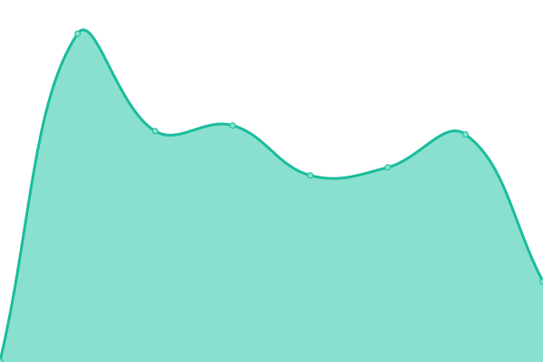

# [📈 Live Status](https://KanteronSystems.github.io/kanteron-uptime): <!--live status--> **🟧 Partial outage**

This repository contains the open-source uptime monitor and status page for [Kanteron Systems](http://kanteron.com), powered by [Upptime](https://github.com/upptime/upptime).

With [Upptime](https://upptime.js.org), you can get your own unlimited and free uptime monitor and status page, powered entirely by a GitHub repository. We use [Issues](https://github.com/KanteronSystems/kanteron-uptime/issues) as incident reports, [Actions](https://github.com/KanteronSystems/kanteron-uptime/actions) as uptime monitors, and [Pages](https://KanteronSystems.github.io/kanteron-uptime) for the status page.

<!--start: status pages-->
<!-- This summary is generated by Upptime (https://github.com/upptime/upptime) -->
<!-- Do not edit this manually, your changes will be overwritten -->
<!-- prettier-ignore -->
| URL | Status | History | Response Time | Uptime |
| --- | ------ | ------- | ------------- | ------ |
|  [Kanteron Website](https://www.kanteron.com/) | 🟩 Up | [kanteron-website.yml](https://github.com/KanteronSystems/kanteron-uptime/commits/HEAD/history/kanteron-website.yml) | 

 720ms
     
 | 

<a href="https://KanteronSystems.github.io/kanteron-uptime/history/kanteron-website">100.00%</a>
    

|  [Kanteron Sitio Web](https://web.kanteron.com/) | 🟩 Up | [kanteron-sitio-web.yml](https://github.com/KanteronSystems/kanteron-uptime/commits/HEAD/history/kanteron-sitio-web.yml) | 

 624ms
     
 | 

<a href="https://KanteronSystems.github.io/kanteron-uptime/history/kanteron-sitio-web">100.00%</a>
    

|  [Kanteron Blog](https://blog.kanteron.com/) | 🟩 Up | [kanteron-blog.yml](https://github.com/KanteronSystems/kanteron-uptime/commits/HEAD/history/kanteron-blog.yml) | 

 385ms
     
 | 

<a href="https://KanteronSystems.github.io/kanteron-uptime/history/kanteron-blog">100.00%</a>
    

|  [Blog de Kanteron](https://bloges.kanteron.com/) | 🟩 Up | [blog-de-kanteron.yml](https://github.com/KanteronSystems/kanteron-uptime/commits/HEAD/history/blog-de-kanteron.yml) | 

 367ms
     
 | 

<a href="https://KanteronSystems.github.io/kanteron-uptime/history/blog-de-kanteron">100.00%</a>
    

|  [Europato](http://europato.kanteron.net/TMIS/login.xhtml) | 🟩 Up | [europato.yml](https://github.com/KanteronSystems/kanteron-uptime/commits/HEAD/history/europato.yml) | 

 366ms
     
 | 

<a href="https://KanteronSystems.github.io/kanteron-uptime/history/europato">100.00%</a>
    

|  [Azapp](https://azapp.kanteron.net/TMIS/login.xhtml) | 🟩 Up | [azapp.yml](https://github.com/KanteronSystems/kanteron-uptime/commits/HEAD/history/azapp.yml) | 

 574ms
     
 | 

<a href="https://KanteronSystems.github.io/kanteron-uptime/history/azapp">100.00%</a>
    

|  [GDB Genomics](https://gdb.genomics.kanteron.com/TMIS/login.xhtml) | 🟥 Down | [gdb-genomics.yml](https://github.com/KanteronSystems/kanteron-uptime/commits/HEAD/history/gdb-genomics.yml) | 

 481ms
     
 | 

<a href="https://KanteronSystems.github.io/kanteron-uptime/history/gdb-genomics">0.00%</a>
    

|  [K3D](https://k3d.kanteron.net/?url=https://s3.eu-central-1.amazonaws.com/ohif-viewer/JSON/PTCTStudy.json) | 🟩 Up | [k3-d.yml](https://github.com/KanteronSystems/kanteron-uptime/commits/HEAD/history/k3-d.yml) | 

 565ms
     
 | 

<a href="https://KanteronSystems.github.io/kanteron-uptime/history/k3-d">100.00%</a>
    

|  [KAV](https://kav.kanteron.net/studylist) | 🟩 Up | [kav.yml](https://github.com/KanteronSystems/kanteron-uptime/commits/HEAD/history/kav.yml) | 

 543ms
     
 | 

<a href="https://KanteronSystems.github.io/kanteron-uptime/history/kav">100.00%</a>
    

|  [KLS](https://kls.kanteron.net/) | 🟩 Up | [kls.yml](https://github.com/KanteronSystems/kanteron-uptime/commits/HEAD/history/kls.yml) | 

 523ms
     
 | 

<a href="https://KanteronSystems.github.io/kanteron-uptime/history/kls">100.00%</a>
    

|  [KDV](http://20.185.6.186/KDV/viewer/1.3.6.1.4.1.14519.5.2.1.2193.7172.847236098565581057121195872945) | 🟩 Up | [kdv.yml](https://github.com/KanteronSystems/kanteron-uptime/commits/HEAD/history/kdv.yml) | 

 98ms
     
 | 

<a href="https://KanteronSystems.github.io/kanteron-uptime/history/kdv">100.00%</a>
    

|  [Central](https://central.kanteron.com/TMIS/login.xhtml) | 🟩 Up | [central.yml](https://github.com/KanteronSystems/kanteron-uptime/commits/HEAD/history/central.yml) | 

 586ms
     
 | 

<a href="https://KanteronSystems.github.io/kanteron-uptime/history/central">100.00%</a>
    

|  [Testing](https://testing.kanteron.com/TMIS/login.xhtml) | 🟩 Up | [testing.yml](https://github.com/KanteronSystems/kanteron-uptime/commits/HEAD/history/testing.yml) | 

 608ms
     
 | 

<a href="https://KanteronSystems.github.io/kanteron-uptime/history/testing">100.00%</a>
    

|  [PACS5](https://kanteron-demo-client1.eastus.cloudapp.azure.com/TMIS/secure/historia/Ficha.xhtml?id=1) | 🟥 Down | [pacs-5.yml](https://github.com/KanteronSystems/kanteron-uptime/commits/HEAD/history/pacs-5.yml) | 

 0ms
     
 | 

<a href="https://KanteronSystems.github.io/kanteron-uptime/history/pacs-5">0.00%</a>
    

<!--end: status pages-->

[**Visit our status website →**](https://KanteronSystems.github.io/kanteron-uptime)

## 📄 License

- Powered by: [Upptime](https://github.com/upptime/upptime)
- Code: [MIT](./LICENSE) © [Kanteron Systems](http://kanteron.com)
- Data in the `./history` directory: [Open Database License](https://opendatacommons.org/licenses/odbl/1-0/)
